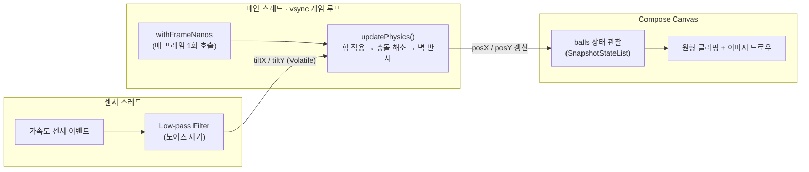

# FastFive

> FASTFIVE 출입증 앱의 기울기 기반 애니메이션 UI를 Jetpack Compose로 재현하는 과정에서 예상치 못한 성능 문제를 발견하고, 측정과 구조 개선을 통해 해결한 개인 프로젝트입니다.

---

## 프로젝트 개요

FASTFIVE 출입증 앱을 사용하던 중, 휴대폰을 기울이면 화면 속 공들이 자연스럽게 움직이는 UI가 인상적이었습니다. "이걸 Jetpack Compose로도 구현할 수 있을까?"라는 단순한 호기심으로 동일한 사용자 경험을 직접 만들어보기 시작했습니다.

처음 목표는 단순한 UI 재현이었습니다. 하지만 구현 과정에서 공이 끊기듯 움직이는 현상을 마주했고, 원인을 추적한 결과 센서 이벤트 기반 상태 갱신 구조와 화면 렌더링 타이밍이 어긋난다는 사실을 발견했습니다.

이후 문제를 재현하고 측정(`adb shell dumpsys gfxinfo`)하며 구조를 개선한 끝에, `withFrameNanos` 기반의 vsync 동기화 게임 루프를 도입해 성능 문제를 해결했습니다.

이 프로젝트는 **"저 UI를 한번 만들어보고 싶다"는 호기심이 사용자 경험 문제 분석과 성능 최적화 경험으로 이어진 과정**을 담은 기록입니다.

---

## 시스템 다이어그램

1. 사용자가 휴대폰을 기울인다.
2. 가속도 센서 값이 저주파 필터를 거쳐 노이즈가 제거된 채 기록된다.
3. 화면 주사율(vsync)에 맞춰 정확히 한 프레임마다 물리 연산(힘 적용 → 충돌 해소 → 벽 충돌)이 실행된다.
4. 공들의 위치가 갱신되고, Compose가 이를 감지해 Canvas를 다시 그린다.
5. 사용자는 끊김 없이 자연스럽게 움직이는 공을 본다.

---

## 핵심 사용자 시나리오

1. 앱을 실행하면 여러 개의 공이 화면 중앙에 가로로 배치되어 있다.
2. 휴대폰을 좌우/앞뒤로 기울인다.
3. 기울인 방향으로 공들이 가속하며 굴러간다.
4. 공들이 서로 부딫히면 질량 비율에 따라 밀려나며 겹치지 않는다.
5. 공이 화면 경계에 닿으면 에너지를 잃으며 튕긴다.

---

## 해결하려는 문제

**문제 상황**

초기 구현은 `SensorEventListener.onSensorChanged()` 콜백 안에서 직접 Compose 상태를 갱신하는 구조였습니다. 가속도 센서는 `SENSOR_DELAY_GAME` 기준으로도 호출 간격이 일정하지 않기 때문에, 물리 연산이 어떤 프레임에서는 여러 번, 어떤 프레임에서는 한 번도 실행되지 않는 상황이 생겼습니다.

**왜 문제였는가**

- 물리 연산 타이밍이 화면 출력 타이밍(vsync)과 무관하게 실행되어, 같은 시간 동안에도 공의 이동 거리가 프레임마다 들쑥날쑥했습니다.
- 디스플레이 갱신 주기와 어긋난 타이밍에 상태가 바뀌면 Compose가 그 프레임을 그리지 못하고 다음 vsync까지 건너뛰는(jank) 현상이 누적됐습니다.
- 실제 같은 에뮬레이터 환경에서 `adb shell dumpsys gfxinfo`로 측정했을 때, Janky Frame 비율이 **82.6%**, 99th percentile 프레임 타임이 **900ms**에 달해 사실상 "뚝뚝 끊기는" 수준이었습니다.

---

## 내가 담당한 역할

> 이 프로젝트는 Claude Code를 구현 보조 도구로 활용한 AI 페어 프로그래밍 방식으로 진행했습니다. 문제 정의, 해결 전략 수립, 구조적 의사결정, 성능 측정 및 검증은 직접 수행했으며, AI가 제안한 구현은 코드 리뷰와 수정 과정을 거쳐 최종 반영했습니다.

| 구분 | 내용 |
|---|---|
| 아이디어 도출 | FASTFIVE 출입증 앱의 UI를 보고 Compose로 구현해보기로 결정 |
| 문제 분석 | 공 움직임이 끊기는 현상을 발견하고, 센서 콜백 기반 갱신 구조를 원인으로 특정 |
| 구조 설계 | `withFrameNanos` 기반 게임 루프, `@Volatile` 공유 상태, 물리 연산 분리 구조를 결정 |
| 구현 검토 | Claude Code가 제안한 구현을 검토하고 수정 방향을 피드백 |
| 성능 검증 | `adb shell dumpsys gfxinfo`로 리팩터링 전후 성능을 직접 측정 및 비교 |

---

## 핵심 문제 해결

### 문제

센서 이벤트 콜백 안에서 직접 물리 상태를 갱신하다 보니, 화면 갱신 타이밍이 디스플레이 vsync와 어긋나 프레임이 누락되는 현상(jank)이 심하게 발생했습니다.

### 접근

후보로 두 가지를 검토했습니다.

- **`delay(16L)`로 고정 주기 코루틴 루프를 돌리는 방식**: 구현은 단순하지만 `delay`는 실제 디스플레이의 vsync 신호와 무관하게 동작하기 때문에, 타이밍이 살짝씩 어긋나는 문제를 근본적으로 해결하지 못함.
- **Compose의 `withFrameNanos`로 vsync에 동기화하는 방식**: Compose가 이미 `MonotonicFrameClock`을 통해 vsync 신호를 받고 있으므로, 그 신호에 물리 연산을 얹으면 화면 출력과 정확히 같은 박자로 갱신할 수 있음.

타이밍 정확도가 핵심 문제였기 때문에 `withFrameNanos` 방식을 선택했습니다.

### 해결

1. 물리 연산(힘 적용 → 충돌 해소 → 벽 충돌)을 `PhysicsViewModel.updatePhysics()`로 분리해 센서 콜백과 렌더링 로직에서 완전히 떼어냄.
2. `LaunchedEffect` 안에서 `while (true) { withFrameNanos { ... } }` 루프를 돌려, 매 vsync마다 정확히 한 번씩만 물리 연산을 실행.
3. 센서 값은 `@Volatile` 필드에 저장만 하고, 게임 루프가 그 값을 읽어가는 구조로 분리(센서 스레드 쓰기 / 메인 스레드 읽기). 센서 입력은 매 프레임 가장 최신 값 하나만 필요했기 때문에, 스트림 수집 비용이 있는 `Flow`/`StateFlow` 대신 메모리 가시성만 보장하면 되는 `@Volatile` 단순 공유 상태를 선택함.
4. 한 프레임을 `SUB_STEPS`만큼 더 작은 단위로 나눠 연산해 빠른 속도에서도 공이 벽을 그대로 통과(터널링)하는 현상을 방지.

### 결과

| 항목 | 리팩터링 전 | 리팩터링 후 |
|---|---|---|
| Janky Frame 비율 | 82.6% | **2.97%** |
| 99th percentile 프레임 타임 | 900ms | **32ms** |

- **기술적 성과**: 동일 에뮬레이터 환경에서 측정한 Janky Frame 비율이 82.6% → 2.97%로, 99th percentile 프레임 타임이 900ms → 32ms로 개선되었습니다.
- **엔지니어링 효과**: 물리 연산과 렌더링 책임이 분리되어, 이후 공 개수나 이미지 추가 같은 기능 변경이 렌더링 로직을 건드리지 않고도 가능해졌습니다.
- **학습 효과**: Compose에서는 "무엇을 그리는가"보다 "언제 상태를 변경하는가"가 체감 성능을 더 크게 좌우할 수 있다는 점을 직접 측정값으로 검증했습니다. 또한 선언적 UI 환경에서도 게임 루프처럼 명시적인 타이밍 제어가 필요한 영역이 존재한다는 것을 이해하게 되었습니다.

---

## 기술 스택

| 분류 | 기술 | 사용 목적 |
|---|---|---|
| Language | Kotlin | Android 앱 개발 언어 |
| UI | Jetpack Compose | 선언적 UI 및 Canvas 기반 커스텀 드로잉 |
| Timing | `withFrameNanos` | vsync 기반 물리 연산 게임 루프 |
| Sensor | `SensorManager` (TYPE_ACCELEROMETER) | 기기 기울기 입력 수집 |
| Architecture | `AndroidViewModel` | 센서 리스너 생명주기 관리 + 물리 상태 보관 |
| Performance | `adb shell dumpsys gfxinfo` | 프레임 드랍(jank) 정량 측정 및 리팩터링 전후 비교 |

---

## 회고

**가장 어려웠던 점**

"코드가 동작한다"와 "코드가 매끄럽게 보인다"가 다른 문제라는 걸 체감한 부분이었습니다. 물리 로직 자체는 처음부터 올바르게 동작했지만, 그 결과가 화면에 출력되는 타이밍이 어긋나면서 실제로는 끊기는 것처럼 보였습니다. 원인을 코드 로직이 아니라 "언제 갱신하는가"라는 타이밍 모델에서 찾아야 했던 점이 가장 까다로웠습니다.

**아쉬웠던 점**

성능 측정을 에뮬레이터 한 환경에서만 진행했습니다. 실제 기기, 특히 저사양 기기에서의 jank 비율은 다를 수 있어 추가 검증이 필요합니다.

**다시 개발한다면**

물리 상수(`SUB_STEPS`, `COLLISION_ITERATIONS` 등)를 바꿀 때마다 체감 성능이 달라지는데, 이를 매번 `dumpsys gfxinfo`로 수동 측정하는 대신 자동화된 성능 회귀 테스트를 만들어두고 싶습니다.

**이번 경험을 통해 얻은 교훈**

처음에는 단순히 "저 UI를 한번 만들어보고 싶다"는 호기심으로 시작했습니다. 하지만 구현 과정에서 예상하지 못한 버벅거림을 마주했고, 문제를 외면하지 않고 원인을 측정하고 검증하는 과정 속에서 "동작하는 코드"와 "좋은 사용자 경험을 만드는 코드"는 다를 수 있다는 점을 배웠습니다. 이 경험 이후에는 문제가 발생했을 때 감으로 수정하기보다, 재현 → 측정 → 원인 분석 → 개선의 과정을 거쳐 판단하려는 습관을 갖게 되었습니다.
